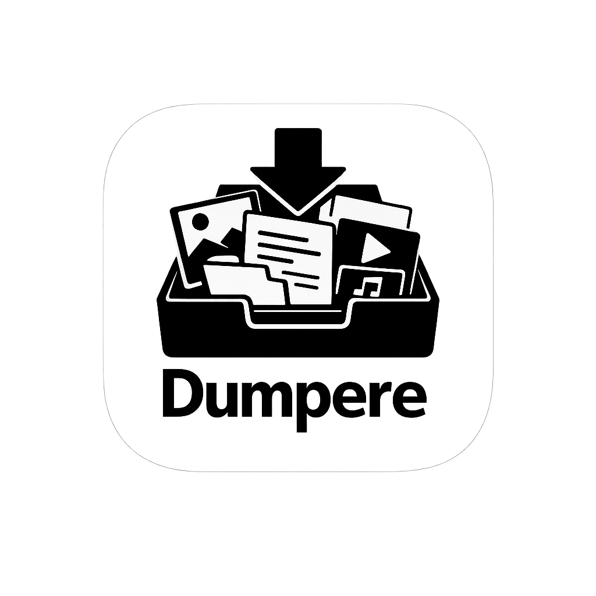
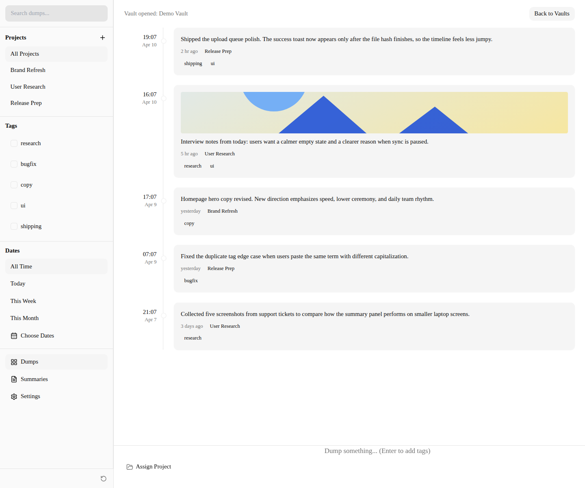
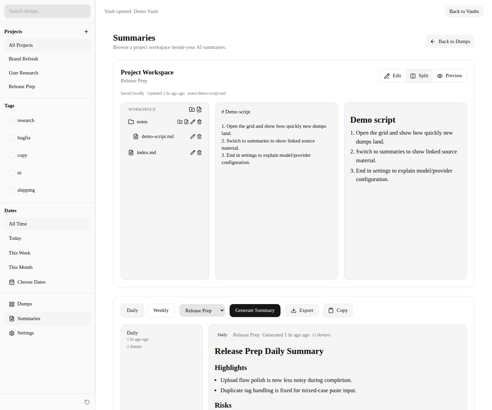
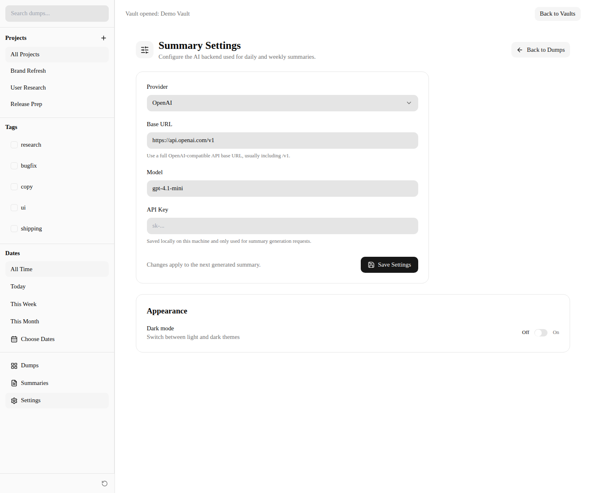

<p align="center"></p>

# Dumpere

A minimalist desktop app for quick work completion tracking. Press Enter to instantly dump text, images, videos, audio, and files together — no friction, no ceremony.

**Core Value:** **Speed first.** Getting content in must be faster than thinking about where it goes.

## Tech

- Electron + TypeScript + React
- Local filesystem storage only

## Demo Screenshots

### Dumps Timeline



### Summaries + Workspace



### Summary Settings



## Commands

```bash
pnpm install          # Install dependencies
pnpm clean            # Remove build and packaging output
pnpm dev              # Start Electron in development mode with hot reload
pnpm dev:web          # Start renderer-only Vite server
pnpm build            # Compile source code
pnpm pack             # Package into unpacked dir (for testing)
pnpm dist             # Build distributable installers for current platform
pnpm dist:linux       # Build Linux packages (AppImage, deb)
pnpm dist:win         # Build Windows packages (nsis, portable)
pnpm dist:mac         # Build macOS packages (dmg on macOS, zip elsewhere)
pnpm dist:mac:dmg     # Build a macOS DMG (run on macOS)
pnpm test             # Run unit tests
pnpm test:e2e         # Run Playwright E2E tests
pnpm test:e2e:headed  # Run E2E tests with visible browser
pnpm fuzz             # Run the full fuzz test suite
pnpm fuzz:ui          # Run UI-focused fuzz tests
pnpm fuzz:ipc         # Run IPC/data-layer fuzz tests
pnpm fuzz:quick       # Run a shorter smoke fuzz pass
```

## License

MIT
